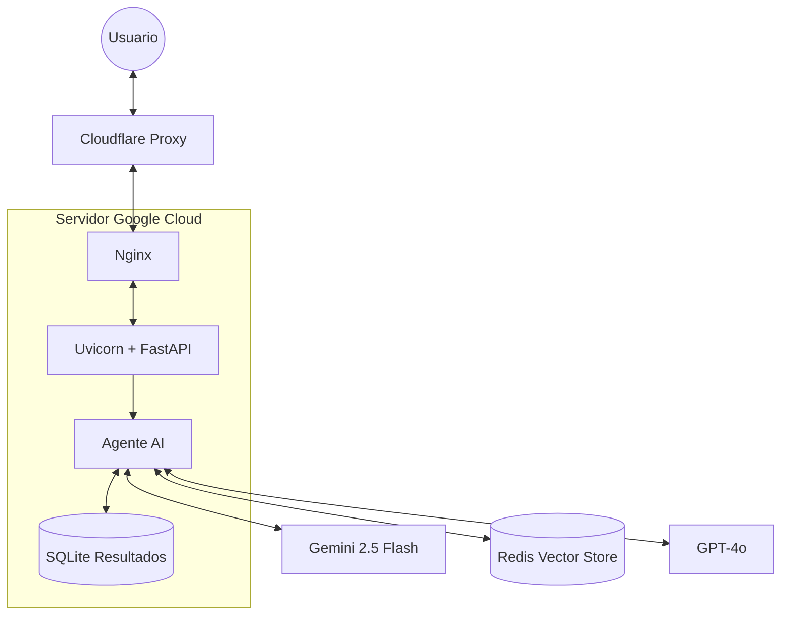

# ⚽️ Agente de IA: Fútbol Chileno 2025 (SQL + RAG)

Este proyecto implementa un Agente de Inteligencia Artificial capaz de responder preguntas sobre el Campeonato Nacional 2025. Utiliza una arquitectura híbrida:

1.  **Agente SQL:** Consulta la base de datos `resultados_campeonato_nacional_2025.db` para obtener estadísticas exactas, resultados de partidos y tablas de posiciones.
2.  **Sistema RAG:** Utiliza `ChromaDB` para buscar información cualitativa en documentos de texto (`equipos_info.txt`, `resultados_2025.txt`) sobre reglas, historia y contexto de los equipos.
=======
# 🤖⚽ Agente de Fútbol Chileno 2025 (Edición Dashboard)

Este proyecto es un **Asistente Experto en el Campeonato Nacional Chileno 2025**, diseñado para responder preguntas complejas sobre resultados, estadísticas y narrativa del torneo.

Combina un **Agente SQL** (para datos duros) con un sistema **RAG** (para contexto histórico), todo presentado en un dashboard moderno y responsivo.

## 🏗️ Arquitectura de Producción

El sistema está desplegado en una infraestructura de alto rendimiento diseñada para seguridad y velocidad:



### Componentes Clave:
*   **Cloudflare:** Provee DNS, Proxy caché y protección DDoS. Gestiona el certificado SSL Edge.
*   **Nginx:** Servidor web reverso que maneja la terminación SSL y redirige el tráfico al puerto interno de la aplicación.
*   **FastAPI + Uvicorn:** Backend asíncrono de alto rendimiento en Python.
*   **Redis Stack:** Motor vectorial para búsquedas semánticas ultrarrápidas (RAG).

---

## 🚀 Funcionalidades

* **Router Inteligente:** Decide automáticamente si usar SQL o RAG según la pregunta.
* **Consulta de Datos:** Responde preguntas complejas como *"¿Quién ganó el partido entre X e Y en la fecha 1?"* o *"¿Cuántos goles de visita tiene la U?"*.
* **Contexto:** Explica reglas y situaciones de equipos basándose en documentos actualizados.

## 🛠 Instalación y Uso

1.  **Clonar repositorio y crear entorno:**
    ```bash
    git clone <URL_DEL_REPO>
    cd futbol-agent
    python3.11 -m venv venv
    source venv/bin/activate
    ```

2.  **Instalar dependencias:**
    ```bash
    pip install -r requirements.txt
    ```

3.  **Configurar API Key:**
    Crea un archivo `.env` con tu llave: `OPENAI_API_KEY=sk-...`

4.  **Inicializar Base de Conocimiento (RAG):**
    Si es la primera vez, ejecuta:
    ```bash
    python ingest_knowledge.py
    ```
    *(Esto procesará los archivos en `data/knowledge_base/` y creará la memoria vectorial)*.

5.  **Ejecutar Agente:**
    ```bash
    uvicorn app.main:app --reload
    ```

## 🧪 Pruebas
* **Swagger UI:** `http://127.0.0.1:8000/docs`
* **Ejemplo SQL:** *"¿Cuáles fueron los resultados de la fecha 1?"*
* **Ejemplo RAG:** *"¿Cuál es el estadio de Colo-Colo?"*

---

### 🧠 Inteligencia Híbrida
*   **Router de Intención (GPT-4o):** Clasifica cada pregunta:
    *   **SQL:** Para resultados, fechas exactas, goleadores, tablas ("¿Cómo salió la U?", "¿Quién es el campeón?").
    *   **RAG:** Para historia, reglas, apodos y contexto ("¿Qué es el Superclásico?", "¿Quiénes descendieron?").
*   **Respaldo Automático:** Usa **GPT-4o** como cerebro principal. Si se agota la cuota, conmuta automáticamente a **Gemini 1.5 Flash**.

### 🛡️ Blindaje Anti-Alucinaciones
*   **Precisión SQL:** Reglas estrictas prohíben inventar goleadores, estadios o datos no columnares.
*   **Validación Ida/Vuelta:** Distingue partidos repetidos exigiendo siempre la fecha exacta en la respuesta.
*   **Lógica de Ganador:** Algoritmo de comparación goles local vs visita para evitar falsos positivos en diferencias de goles.
*   **Sin IDs:** Respuestas limpias que solo usan nombres de equipos, ocultando IDs internos de base de datos.

### 📊 Dashboard Interactivo
*   **Frontend Moderno:** HTML5 + CSS Grid con diseño Glassmorphism.
*   **Stats en Tiempo Real:** Sidebar con Top 5 de la tabla y Últimos 5 Resultados directo desde SQLite.
*   **Responsive:** Adaptable a móviles y escritorio.

---

## 🛠️ Instalación y Despliegue

### Requisitos Previos
*   Python 3.10+
*   Redis Stack Server (corriendo local o en Docker)
*   Claves API: `OPENAI_API_KEY`, `GEMINI_API_KEY`

### 1. Configuración de Entorno
Crea un archivo `.env` en la raíz:
```env
OPENAI_API_KEY=sk-...
GEMINI_API_KEY=AIza...
REDIS_HOST=localhost
REDIS_PORT=6379
REDIS_PASSWORD=...
REDIS_INDEX=agente_futbol
```

### 2. Generación de Base de Datos
Crea la base de datos SQLite y puebla los datos iniciales:
```bash
python3 data/generar_db.py
```

### 3. Ingesta de Conocimiento (RAG)
Procesa los archivos de texto (`data/knowledge_base/*.txt`) y genera los embeddings en Redis:
```bash
python3 ingest_knowledge.py
```

### 4. Ejecución del Servidor
Para correr en modo producción (background):
```bash
nohup python3 -m uvicorn app.main:app --host 0.0.0.0 --port 8000 --proxy-headers > app.log 2>&1 &
```

---

## 📂 Estructura del Proyecto

```text
.
├── app/
│   ├── main.py            # 🧠 Cerebro del Agente (API + Lógica)
│   └── frontend/          # 🎨 Interfaz de Usuario
│       ├── index.html
│       ├── style.css
│       └── script.js
├── data/
│   ├── campeonato_2025.db # 🗄️ Base de datos SQL
│   ├── generar_db.py      # Script de creación SQL
│   └── knowledge_base/    # 📄 Archivos de texto para RAG
├── ingest_knowledge.py    # ⚙️ Script de carga vectorial a Redis
└── requirements.txt       # Dependencias ligeras (GCP friendly)
```

---

## 🏆 Créditos
Desarrollado para la **UAI** como demostración de un Agente AI Avanzado con capacidades de razonamiento SQL+RAG y arquitectura resiliente.
Nombres: Sebastián Soto, Pralad Varela, Mauricio Gallardo y Raúl Cantero. (Grupo 14)